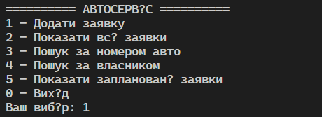
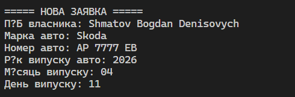
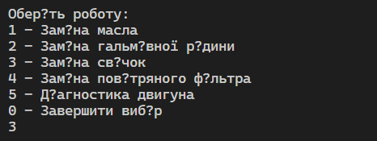
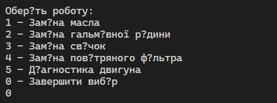
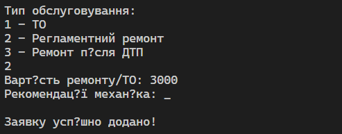
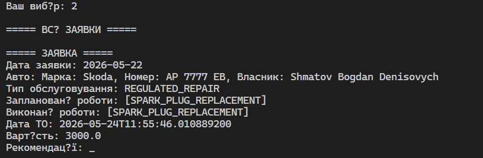

# Індивідуальне домашнє завдання
ІДЗ з дисципліни "Кросплатформене програмування"

# Постановка задачі
## Варіант №4

Додаток «Автосервіс». Додаток буде використовуватись на станції технічного обслуговування автомобілів і його призначено для внесення таких даних: 
 - дата заповнення заявки на обслуговування;
 - ПІБ власника авто;
 - марка авто;
 - держномер авто;
 - дата випуску авто;
 - список регламентних робіт за технічною документацією;
 - дата та час призначення ТО;
 -  вид обслуговування (ТО, регламентний ремонт, ремонт після ДТП);
 - дата останнього ТО;
 - дата останнього ремонту;
 - види виконаних робіт за списком (заміна масла, заміна гальмівної рідини, заміна свічок, заміна повітряних фільтрів та ін.);
 - коштовність ТО або ремонту;
 - рекомендації від механіка.

Для виконання другої частини завдання передбачити отримання: загальної форми заявки на ТО із списком робіт за планом ТО та їх коштовність, яка буде
надаватись клієнту:
- список робіт для механіка, які слід зробити для певного авто за номерним знаком;
- список виконаних ремонтів та ТО за певною датою;
- списокзаявок на обслуговування які заплановано
- пошук авто за номерним знаком та власником.

# Хід роботи
У ході виконання лабораторної роботи було розроблено консольний додаток «Автосервіс» мовою програмування Java.

Спочатку було спроєктовано структуру програми, яка включає основні сутності: автомобіль, власник та заявка на технічне обслуговування. Для кожної сутності були створені окремі класи, що дозволило реалізувати принципи об’єктно-орієнтованого програмування.

Далі було визначено перелік типів робіт та видів обслуговування за допомогою enum, що забезпечило зручність у використанні фіксованих значень.

## Основна логіка програми
Основна логіка програми реалізована у класі менеджера автосервісу, який відповідає за:

 - додавання нових заявок;
 - збереження інформації про автомобілі та їх власників;
 - пошук заявок за номером автомобіля та ПІБ власника;
 - перегляд запланованих та виконаних робіт;
 - формування списку робіт для механіка.

У головному класі Main реалізовано текстове меню, яке дозволяє користувачу взаємодіяти з програмою через консоль. Всі дані вводяться з клавіатури за допомогою Scanner.

Також було реалізовано:

 - введення та обробку даних користувача;
 - формування списку регламентних робіт;
 - розрахунок вартості обслуговування;
 - виведення детальної інформації про заявки.

У результаті програма дозволяє моделювати роботу автосервісу та виконувати базові операції з обліку автомобілів і технічного обслуговування.

## Скріншот роботи програми
Після запуску програми користувачу відображається головне меню, яке дозволяє обрати необхідну операцію.

Програма надає можливість:

- створити нову заявку на технічне обслуговування автомобіля;
- ввести дані про власника та автомобіль;
- обрати перелік регламентних робіт;
- визначити тип обслуговування;
- вказати вартість робіт та рекомендації механіка;
- переглядати всі створені заявки;
- здійснювати пошук заявок за номером автомобіля;
- здійснювати пошук за ПІБ власника;
- переглядати заплановані заявки на обслуговування.

Далі програма надає можливість користувачеві ввести дані:

  

Після введення даних система формує заявку та зберігає її у пам’яті програми.

